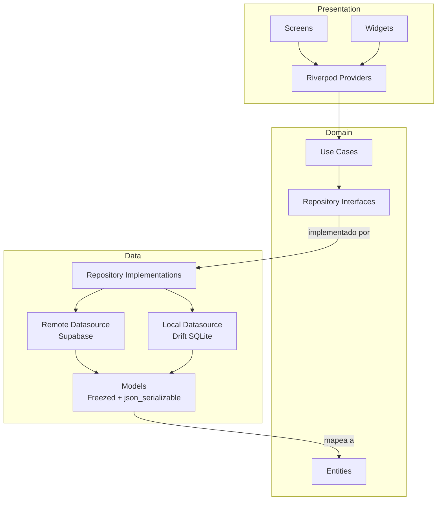
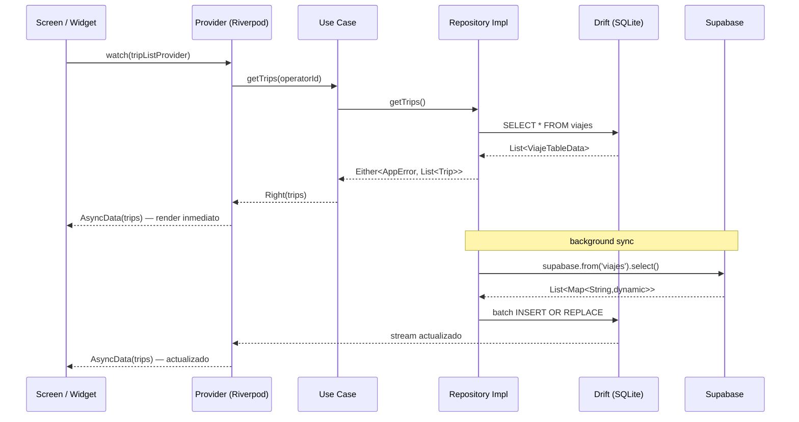
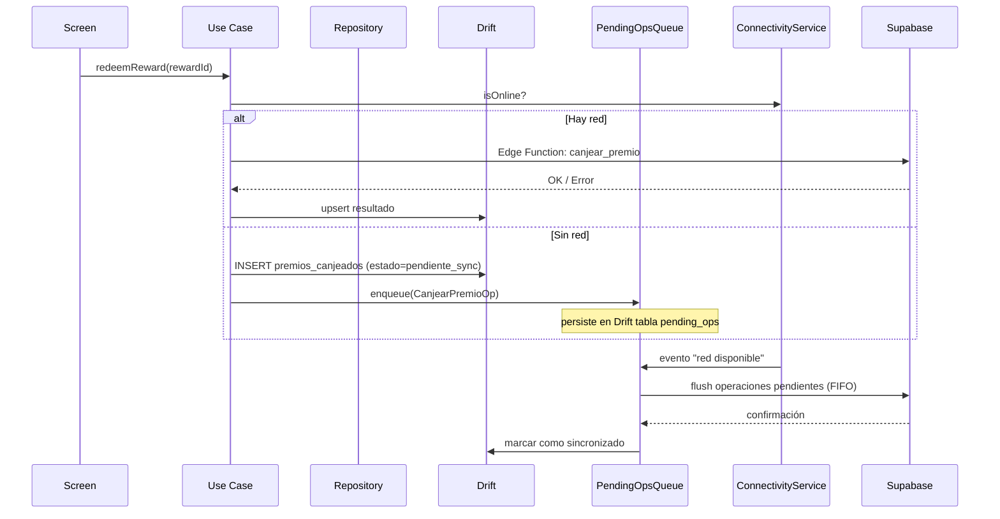
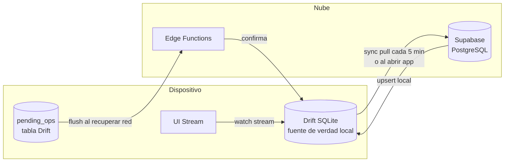
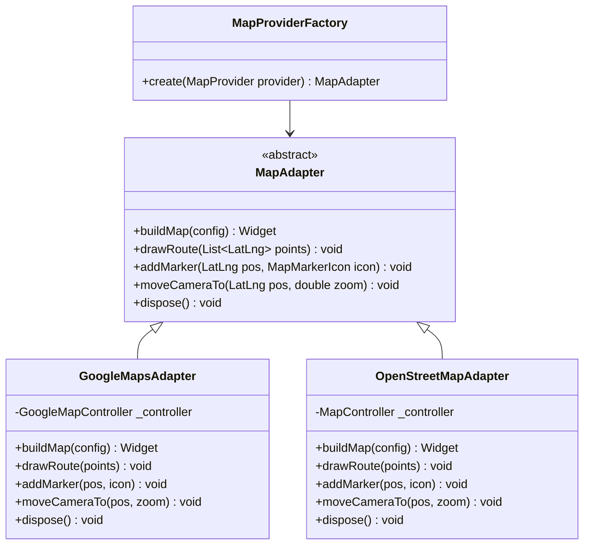
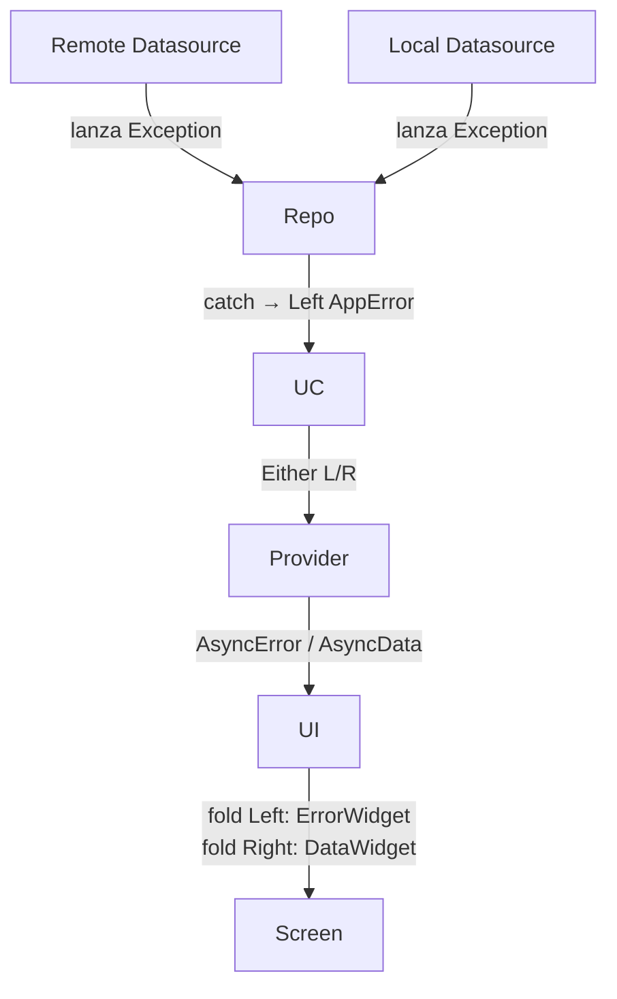

# Arquitectura — OperadorApp

## Resumen

OperadorApp sigue **Clean Architecture** con tres capas por feature (`domain`, `data`, `presentation`)
y una estrategia **offline-first** donde Drift (SQLite local) es la fuente única de verdad para la UI.
Supabase actúa como origen autoritativo de datos y se sincroniza en background.

---

## Capas de Clean Architecture



**Regla de dependencia:** las flechas solo apuntan hacia `Domain`. `Domain` no importa nada de `Data`
ni de `Presentation`. Esto garantiza que la lógica de negocio sea independiente de Flutter y Supabase.

---

## Flujo de datos completo (lectura)



---

## Flujo de datos (escritura offline-first)



---

## Estrategia offline-first con Drift + Supabase



### Principios:
1. **La UI siempre lee de Drift** → respuesta inmediata, sin pantallas de carga por red
2. **El sync con Supabase es en background** → el operador no espera
3. **Escrituras sin red se encolan** → se envían cuando vuelve la conectividad
4. **Los datos críticos usan server-wins** → si hay conflicto, la versión del servidor gana
5. **Datos editables por el operador usan last-write-wins con timestamp**

---

## Patrón Adapter para mapas



La selección de implementación se hace en tiempo de ejecución desde `AppConfig`:

```
MAP_PROVIDER=osm   → OpenStreetMapAdapter  (default dev)
MAP_PROVIDER=google → GoogleMapsAdapter    (producción)
```

El widget `TripMapView` usa `MapAdapter` sin saber qué implementación tiene debajo.

---

## Manejo de errores



`AppError` es un sealed class con variantes: `NetworkError`, `AuthError`, `NotFoundError`,
`ValidationError`, `UnexpectedError`. La UI maneja cada caso explícitamente.

---

## Decisiones técnicas

### Riverpod 2.x vs Bloc vs GetX
Riverpod unifica DI + state management. Los `AsyncNotifier` encajan con `Either<AppError, T>`.
`riverpod_generator` elimina boilerplate. Mejor aislamiento en tests que GetX.

### Drift vs Hive vs Isar
Drift valida queries SQL en tiempo de compilación. Soporta migrations versionadas, transacciones
ACID, JOINs (necesarios: viajes → gps_points → alertas). `drift_dev` genera mocks para tests.

### Supabase vs Firebase
PostgreSQL real con PostGIS para rutas. SQL sin límites de Firestore. RLS declarativa en BD.
Edge Functions para lógica de negocio que no debe vivir en el cliente. Open source y portable.

### fpdart (Either/Option) vs try/catch
Errores explícitos y tipados en la firma de cada función. La UI sabe exactamente qué puede
fallar sin leer la implementación. Composición funcional: `map`, `flatMap`, `fold` sin anidamiento.

### GoRouter vs Navigator 2.0 directo
Guards de autenticación como `redirect`. Deep linking listo. Compatible con web si se necesita.
Más declarativo y testeable que Navigator imperativo.
