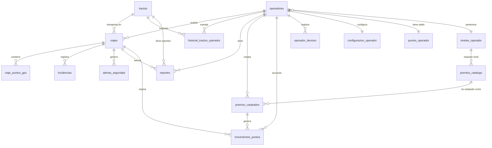

# Esquema de Base de Datos — OperadorApp

Base de datos PostgreSQL 15+ en Supabase con PostGIS habilitado.
El script SQL completo al final de este documento está listo para ejecutar en Supabase.

---

## Diagrama de relaciones



---

## Descripción de tablas

### `operadores`
El corazón del sistema. Cada fila es un operador activo o histórico vinculado a `auth.users` de Supabase.
Los puntos totales y disponibles se actualizan por trigger cuando cambia `puntos_operador`.

### `niveles_operador`
Catálogo de los 5 niveles gamificados. Configurable desde la BD sin tocar código.
Incluye puntos mínimos, colores y URLs de íconos/badges.

### `tractos`
Catálogo de unidades de transporte. El número económico es el identificador de negocio.
`rendimiento_esperado` en km/litro es la base para calcular el puntaje de rendimiento.

### `viajes`
Un viaje va de `asignado` → `en_curso` → `completado`. El campo `estado` dispara el cálculo de puntos.
Las coordenadas de origen/destino usan `GEOGRAPHY(POINT, 4326)` de PostGIS.

### `viaje_puntos_gps`
Los inserta un sistema externo (proveedor GPS). La app solo los consume para dibujar la ruta.
La columna `coordenada` usa `GEOGRAPHY(POINT, 4326)` para cálculos de distancia nativos.

### `historial_tractos_operador`
Registro de qué operador manejó qué tracto y en qué período. Solo uno puede estar `activo = true`
por tracto a la vez.

### `reportes`
Unifica reportes de mantenimiento, choques e incidencias en una tabla con discriminador `tipo`.
Puede o no estar asociado a un viaje (hay reportes de patio).

### `incidencias`
Eventos puntuales dentro de un viaje: semáforo en rojo, desvío, retraso en frontera, etc.
Cada incidencia tiene un impacto negativo en puntos.

### `alertas_seguridad`
Las genera el proveedor GPS externo y las inserta en la BD. Son: freno brusco, aceleración brusca,
exceso de velocidad. Cada alerta impacta negativamente el puntaje de seguridad del viaje.

### `reglas_puntaje`
Catálogo configurable de reglas para calcular puntos por viaje. La fórmula es un JSON que
la Edge Function interpreta. Agregar/modificar reglas no requiere desplegar código.

### `premios_catalogo`
Catálogo dinámico de premios. RH puede agregar premios desde un panel sin tocar código.
`stock = NULL` significa ilimitado. `nivel_minimo` restringe quién puede canjear.

### `premios_canjeados`
Registro de cada solicitud de canje con su ciclo de vida completo.
La Edge Function crea el registro al validar puntos suficientes.

### `puntos_operador`
Tabla de agregados mantenida por trigger. Evita recalcular sumas en cada consulta.
Se actualiza automáticamente cuando cambia `movimientos_puntos`.

### `movimientos_puntos`
Libro mayor de puntos. Cada ganancia o gasto queda registrado con su saldo resultante.
Inmutable: no se editan registros, solo se insertan. Los ajustes manuales son nuevas filas.

### `operador_devices`
Tokens FCM por dispositivo del operador. Un operador puede tener múltiples dispositivos.
Se limpia en logout y se actualiza cuando FCM renueva el token.

### `configuracion_operador`
Preferencias locales del operador: tema, idioma, toggles de notificaciones.
Sincronizada con la BD para que persista entre dispositivos.

### `notificaciones_in_app`
Las crea el backend (triggers o Edge Functions). La app las muestra como banners.
Supabase Realtime notifica al cliente en tiempo real cuando se inserta una fila.

---

## Script SQL completo

```sql
-- =============================================================================
-- OPERADORAPP — Script de base de datos para Supabase
-- PostgreSQL 15+ con PostGIS
-- Ejecutar en orden: extensiones → tipos → tablas → índices →
--                    funciones → triggers → políticas RLS → seed
-- =============================================================================


-- =============================================================================
-- 1. EXTENSIONES
-- =============================================================================

CREATE EXTENSION IF NOT EXISTS "uuid-ossp";
CREATE EXTENSION IF NOT EXISTS postgis;
CREATE EXTENSION IF NOT EXISTS pg_trgm; -- búsqueda de texto fuzzy (futuro)


-- =============================================================================
-- 2. TIPOS / ENUMS
-- =============================================================================

CREATE TYPE nivel_operador_enum AS ENUM (
    'plata', 'oro', 'platino', 'esmeralda', 'diamante'
);

CREATE TYPE estado_viaje_enum AS ENUM (
    'asignado', 'en_curso', 'completado', 'cancelado', 'incidente'
);

CREATE TYPE tipo_reporte_enum AS ENUM (
    'mantenimiento', 'choque', 'incidencia', 'seguridad'
);

CREATE TYPE estado_reporte_enum AS ENUM (
    'abierto', 'en_proceso', 'cerrado'
);

CREATE TYPE tipo_premio_enum AS ENUM (
    'efectivo', 'tarjeta_regalo', 'producto_fisico', 'experiencia', 'vehiculo'
);

CREATE TYPE estado_canje_enum AS ENUM (
    'solicitado', 'aprobado', 'entregado', 'rechazado', 'cancelado'
);

CREATE TYPE tipo_movimiento_enum AS ENUM (
    'ganado_viaje', 'canjeado', 'ajuste_manual', 'bonificacion', 'penalizacion'
);


-- =============================================================================
-- 3. TABLAS
-- =============================================================================

-- -----------------------------------------------------------------------------
-- niveles_operador: catálogo de niveles gamificados
-- -----------------------------------------------------------------------------
CREATE TABLE niveles_operador (
    id                UUID PRIMARY KEY DEFAULT uuid_generate_v4(),
    nombre            nivel_operador_enum UNIQUE NOT NULL,
    puntos_minimos    INTEGER NOT NULL,
    puntos_maximos    INTEGER,           -- NULL en Diamante (sin techo)
    descripcion       TEXT,
    color_hex         VARCHAR(7) NOT NULL DEFAULT '#C0C0C0',
    icono_url         TEXT,
    beneficios        JSONB DEFAULT '[]'::jsonb,
    orden             SMALLINT NOT NULL, -- para ordenar sin depender del enum
    created_at        TIMESTAMPTZ NOT NULL DEFAULT NOW()
);

-- -----------------------------------------------------------------------------
-- operadores: operadores vinculados a auth.users de Supabase
-- -----------------------------------------------------------------------------
CREATE TABLE operadores (
    id                  UUID PRIMARY KEY DEFAULT uuid_generate_v4(),
    auth_user_id        UUID UNIQUE REFERENCES auth.users(id) ON DELETE SET NULL,
    numero_empleado     VARCHAR(20) UNIQUE NOT NULL,
    nombre_completo     VARCHAR(255) NOT NULL,
    email               VARCHAR(255),
    telefono            VARCHAR(20),
    fecha_ingreso       DATE NOT NULL,
    base                VARCHAR(100),
    foto_perfil_url     TEXT,
    nivel_actual        nivel_operador_enum NOT NULL DEFAULT 'plata',
    activo              BOOLEAN NOT NULL DEFAULT true,
    created_at          TIMESTAMPTZ NOT NULL DEFAULT NOW(),
    updated_at          TIMESTAMPTZ NOT NULL DEFAULT NOW(),

    CONSTRAINT fk_nivel FOREIGN KEY (nivel_actual)
        REFERENCES niveles_operador(nombre)
);

-- -----------------------------------------------------------------------------
-- tractos: unidades de transporte (tractocamiones)
-- -----------------------------------------------------------------------------
CREATE TABLE tractos (
    id                      UUID PRIMARY KEY DEFAULT uuid_generate_v4(),
    numero_economico        VARCHAR(50) UNIQUE NOT NULL,
    marca                   VARCHAR(100),
    modelo                  VARCHAR(100),
    anio                    SMALLINT,
    placa                   VARCHAR(20),
    vin                     VARCHAR(50),
    rendimiento_esperado    DECIMAL(5,2),   -- km por litro de diesel
    activo                  BOOLEAN NOT NULL DEFAULT true,
    created_at              TIMESTAMPTZ NOT NULL DEFAULT NOW(),
    updated_at              TIMESTAMPTZ NOT NULL DEFAULT NOW()
);

-- -----------------------------------------------------------------------------
-- viajes: viajes realizados o en curso
-- -----------------------------------------------------------------------------
CREATE TABLE viajes (
    id                  UUID PRIMARY KEY DEFAULT uuid_generate_v4(),
    operador_id         UUID NOT NULL REFERENCES operadores(id),
    tracto_id           UUID NOT NULL REFERENCES tractos(id),
    origen              VARCHAR(255) NOT NULL,
    destino             VARCHAR(255) NOT NULL,
    origen_coords       GEOGRAPHY(POINT, 4326),
    destino_coords      GEOGRAPHY(POINT, 4326),
    fecha_inicio        TIMESTAMPTZ,
    fecha_fin           TIMESTAMPTZ,
    km_esperados        DECIMAL(10,2),
    km_recorridos       DECIMAL(10,2),
    litros_diesel       DECIMAL(10,2),
    rendimiento_real    DECIMAL(5,2),       -- km/litro real del viaje
    costo_diesel        DECIMAL(12,2),
    estado              estado_viaje_enum NOT NULL DEFAULT 'asignado',
    calificacion        DECIMAL(3,2) CHECK (calificacion BETWEEN 0 AND 10),
    puntos_obtenidos    INTEGER,
    eta                 TIMESTAMPTZ,
    notas               TEXT,
    created_at          TIMESTAMPTZ NOT NULL DEFAULT NOW(),
    updated_at          TIMESTAMPTZ NOT NULL DEFAULT NOW()
);

-- -----------------------------------------------------------------------------
-- viaje_puntos_gps: trazado de ruta — los inserta el proveedor GPS externo
-- -----------------------------------------------------------------------------
CREATE TABLE viaje_puntos_gps (
    id              UUID PRIMARY KEY DEFAULT uuid_generate_v4(),
    viaje_id        UUID NOT NULL REFERENCES viajes(id) ON DELETE CASCADE,
    coordenada      GEOGRAPHY(POINT, 4326) NOT NULL,
    velocidad_kmh   DECIMAL(6,2),
    rumbo_grados    DECIMAL(5,2),          -- 0-360
    altitud_m       DECIMAL(8,2),
    timestamp_gps   TIMESTAMPTZ NOT NULL,
    proveedor_gps   VARCHAR(100),
    raw_data        JSONB,
    created_at      TIMESTAMPTZ NOT NULL DEFAULT NOW()
);

-- -----------------------------------------------------------------------------
-- historial_tractos_operador: qué tracto manejó cada operador y cuándo
-- -----------------------------------------------------------------------------
CREATE TABLE historial_tractos_operador (
    id                      UUID PRIMARY KEY DEFAULT uuid_generate_v4(),
    operador_id             UUID NOT NULL REFERENCES operadores(id),
    tracto_id               UUID NOT NULL REFERENCES tractos(id),
    fecha_inicio            DATE NOT NULL,
    fecha_fin               DATE,
    km_recorridos           DECIMAL(12,2) DEFAULT 0,
    viajes_realizados       INTEGER DEFAULT 0,
    calificacion_promedio   DECIMAL(3,2),
    activo                  BOOLEAN NOT NULL DEFAULT false,  -- solo uno activo por tracto
    created_at              TIMESTAMPTZ NOT NULL DEFAULT NOW(),
    updated_at              TIMESTAMPTZ NOT NULL DEFAULT NOW()
);

-- -----------------------------------------------------------------------------
-- reportes: mantenimiento, choques e incidencias
-- -----------------------------------------------------------------------------
CREATE TABLE reportes (
    id              UUID PRIMARY KEY DEFAULT uuid_generate_v4(),
    viaje_id        UUID REFERENCES viajes(id),            -- nullable: hay reportes de patio
    operador_id     UUID NOT NULL REFERENCES operadores(id),
    tracto_id       UUID REFERENCES tractos(id),
    tipo            tipo_reporte_enum NOT NULL,
    estado          estado_reporte_enum NOT NULL DEFAULT 'abierto',
    descripcion     TEXT NOT NULL,
    fotos_urls      TEXT[] DEFAULT '{}',
    coordenada      GEOGRAPHY(POINT, 4326),
    fecha_reporte   TIMESTAMPTZ NOT NULL DEFAULT NOW(),
    fecha_cierre    TIMESTAMPTZ,
    resolucion      TEXT,
    created_at      TIMESTAMPTZ NOT NULL DEFAULT NOW(),
    updated_at      TIMESTAMPTZ NOT NULL DEFAULT NOW()
);

-- -----------------------------------------------------------------------------
-- incidencias: eventos puntuales durante un viaje
-- -----------------------------------------------------------------------------
CREATE TABLE incidencias (
    id                      UUID PRIMARY KEY DEFAULT uuid_generate_v4(),
    viaje_id                UUID NOT NULL REFERENCES viajes(id) ON DELETE CASCADE,
    operador_id             UUID NOT NULL REFERENCES operadores(id),
    tipo                    VARCHAR(100) NOT NULL,   -- 'desvio', 'retraso_frontera', etc.
    descripcion             TEXT,
    severidad               SMALLINT CHECK (severidad BETWEEN 1 AND 5),
    coordenada              GEOGRAPHY(POINT, 4326),
    timestamp_incidencia    TIMESTAMPTZ NOT NULL,
    impacto_puntos          INTEGER NOT NULL DEFAULT 0,  -- negativo
    created_at              TIMESTAMPTZ NOT NULL DEFAULT NOW()
);

-- -----------------------------------------------------------------------------
-- alertas_seguridad: frenos bruscos, aceleraciones, exceso de velocidad
-- Las inserta el proveedor GPS externo; la app las consume.
-- -----------------------------------------------------------------------------
CREATE TABLE alertas_seguridad (
    id                  UUID PRIMARY KEY DEFAULT uuid_generate_v4(),
    viaje_id            UUID NOT NULL REFERENCES viajes(id) ON DELETE CASCADE,
    operador_id         UUID NOT NULL REFERENCES operadores(id),
    tipo                VARCHAR(100) NOT NULL,   -- 'freno_brusco', 'aceleracion_brusca', 'exceso_velocidad'
    valor_medido        DECIMAL(10,2),           -- ej: 95 km/h
    umbral_permitido    DECIMAL(10,2),           -- ej: 90 km/h
    coordenada          GEOGRAPHY(POINT, 4326),
    timestamp_alerta    TIMESTAMPTZ NOT NULL,
    impacto_puntos      INTEGER NOT NULL DEFAULT 0,
    created_at          TIMESTAMPTZ NOT NULL DEFAULT NOW()
);

-- -----------------------------------------------------------------------------
-- reglas_puntaje: fórmulas de cálculo de puntos configurables
-- -----------------------------------------------------------------------------
CREATE TABLE reglas_puntaje (
    id          UUID PRIMARY KEY DEFAULT uuid_generate_v4(),
    nombre      VARCHAR(255) NOT NULL,
    descripcion TEXT,
    variable    VARCHAR(100) NOT NULL UNIQUE,  -- 'rendimiento', 'frenos_bruscos', etc.
    formula     JSONB NOT NULL,               -- interpretada por Edge Function
    peso        DECIMAL(5,2) NOT NULL DEFAULT 1.0,
    activa      BOOLEAN NOT NULL DEFAULT true,
    created_at  TIMESTAMPTZ NOT NULL DEFAULT NOW(),
    updated_at  TIMESTAMPTZ NOT NULL DEFAULT NOW()
);

-- -----------------------------------------------------------------------------
-- premios_catalogo: catálogo dinámico de premios
-- -----------------------------------------------------------------------------
CREATE TABLE premios_catalogo (
    id              UUID PRIMARY KEY DEFAULT uuid_generate_v4(),
    nombre          VARCHAR(255) NOT NULL,
    descripcion     TEXT,
    tipo            tipo_premio_enum NOT NULL,
    costo_puntos    INTEGER NOT NULL CHECK (costo_puntos > 0),
    nivel_minimo    nivel_operador_enum,              -- NULL = todos los niveles
    imagen_url      TEXT,
    animacion_url   TEXT,
    stock           INTEGER,                          -- NULL = ilimitado
    activo          BOOLEAN NOT NULL DEFAULT true,
    metadata        JSONB DEFAULT '{}'::jsonb,         -- datos extra por tipo de premio
    orden           SMALLINT,                         -- orden en el roadmap
    created_at      TIMESTAMPTZ NOT NULL DEFAULT NOW(),
    updated_at      TIMESTAMPTZ NOT NULL DEFAULT NOW()
);

-- -----------------------------------------------------------------------------
-- premios_canjeados: historial de canjes con ciclo de vida completo
-- -----------------------------------------------------------------------------
CREATE TABLE premios_canjeados (
    id                  UUID PRIMARY KEY DEFAULT uuid_generate_v4(),
    operador_id         UUID NOT NULL REFERENCES operadores(id),
    premio_id           UUID NOT NULL REFERENCES premios_catalogo(id),
    puntos_canjeados    INTEGER NOT NULL,
    estado              estado_canje_enum NOT NULL DEFAULT 'solicitado',
    notas_operador      TEXT,
    notas_rh            TEXT,
    fecha_solicitud     TIMESTAMPTZ NOT NULL DEFAULT NOW(),
    fecha_aprobacion    TIMESTAMPTZ,
    fecha_entrega       TIMESTAMPTZ,
    created_at          TIMESTAMPTZ NOT NULL DEFAULT NOW(),
    updated_at          TIMESTAMPTZ NOT NULL DEFAULT NOW()
);

-- -----------------------------------------------------------------------------
-- puntos_operador: agregados de puntos mantenidos por trigger
-- -----------------------------------------------------------------------------
CREATE TABLE puntos_operador (
    operador_id         UUID PRIMARY KEY REFERENCES operadores(id) ON DELETE CASCADE,
    puntos_ganados      INTEGER NOT NULL DEFAULT 0,   -- total histórico ganado
    puntos_canjeados    INTEGER NOT NULL DEFAULT 0,   -- total histórico canjeado
    puntos_disponibles  INTEGER NOT NULL DEFAULT 0,   -- ganados - canjeados + ajustes
    ultimo_calculo      TIMESTAMPTZ NOT NULL DEFAULT NOW()
);

-- -----------------------------------------------------------------------------
-- movimientos_puntos: libro mayor inmutable de puntos
-- -----------------------------------------------------------------------------
CREATE TABLE movimientos_puntos (
    id              UUID PRIMARY KEY DEFAULT uuid_generate_v4(),
    operador_id     UUID NOT NULL REFERENCES operadores(id),
    tipo            tipo_movimiento_enum NOT NULL,
    puntos          INTEGER NOT NULL,        -- positivo = ganado, negativo = gastado
    viaje_id        UUID REFERENCES viajes(id),
    canje_id        UUID REFERENCES premios_canjeados(id),
    descripcion     TEXT,
    saldo_despues   INTEGER NOT NULL,
    created_at      TIMESTAMPTZ NOT NULL DEFAULT NOW()
);

-- -----------------------------------------------------------------------------
-- operador_devices: tokens FCM para push notifications
-- -----------------------------------------------------------------------------
CREATE TABLE operador_devices (
    id                  UUID PRIMARY KEY DEFAULT uuid_generate_v4(),
    operador_id         UUID NOT NULL REFERENCES operadores(id) ON DELETE CASCADE,
    fcm_token           TEXT NOT NULL,
    plataforma          VARCHAR(10) NOT NULL CHECK (plataforma IN ('android', 'ios')),
    activo              BOOLEAN NOT NULL DEFAULT true,
    ultima_actualizacion TIMESTAMPTZ NOT NULL DEFAULT NOW(),
    created_at          TIMESTAMPTZ NOT NULL DEFAULT NOW(),

    UNIQUE (operador_id, fcm_token)
);

-- -----------------------------------------------------------------------------
-- configuracion_operador: preferencias de la app por operador
-- -----------------------------------------------------------------------------
CREATE TABLE configuracion_operador (
    operador_id             UUID PRIMARY KEY REFERENCES operadores(id) ON DELETE CASCADE,
    tema                    VARCHAR(10) NOT NULL DEFAULT 'system'
                                CHECK (tema IN ('light', 'dark', 'system')),
    idioma                  VARCHAR(5) NOT NULL DEFAULT 'es_MX',
    notificaciones_push     BOOLEAN NOT NULL DEFAULT true,
    notificaciones_in_app   BOOLEAN NOT NULL DEFAULT true,
    created_at              TIMESTAMPTZ NOT NULL DEFAULT NOW(),
    updated_at              TIMESTAMPTZ NOT NULL DEFAULT NOW()
);

-- -----------------------------------------------------------------------------
-- notificaciones_in_app: notificaciones creadas por el backend
-- -----------------------------------------------------------------------------
CREATE TABLE notificaciones_in_app (
    id          UUID PRIMARY KEY DEFAULT uuid_generate_v4(),
    operador_id UUID NOT NULL REFERENCES operadores(id) ON DELETE CASCADE,
    titulo      VARCHAR(255) NOT NULL,
    cuerpo      TEXT NOT NULL,
    tipo        VARCHAR(100),               -- 'viaje_asignado', 'puntos_acreditados', etc.
    leida       BOOLEAN NOT NULL DEFAULT false,
    metadata    JSONB DEFAULT '{}'::jsonb,
    created_at  TIMESTAMPTZ NOT NULL DEFAULT NOW()
);


-- =============================================================================
-- 4. ÍNDICES
-- =============================================================================

-- operadores
CREATE INDEX idx_operadores_auth_user_id ON operadores(auth_user_id);
CREATE INDEX idx_operadores_numero_empleado ON operadores(numero_empleado);

-- viajes
CREATE INDEX idx_viajes_operador_id ON viajes(operador_id);
CREATE INDEX idx_viajes_tracto_id ON viajes(tracto_id);
CREATE INDEX idx_viajes_estado ON viajes(estado);
CREATE INDEX idx_viajes_fecha_inicio ON viajes(fecha_inicio DESC);
CREATE INDEX idx_viajes_updated_at ON viajes(updated_at DESC); -- sync incremental

-- viaje_puntos_gps
CREATE INDEX idx_puntos_gps_viaje_id ON viaje_puntos_gps(viaje_id);
CREATE INDEX idx_puntos_gps_timestamp ON viaje_puntos_gps(viaje_id, timestamp_gps);

-- reportes
CREATE INDEX idx_reportes_operador_id ON reportes(operador_id);
CREATE INDEX idx_reportes_viaje_id ON reportes(viaje_id);
CREATE INDEX idx_reportes_estado ON reportes(estado);

-- incidencias
CREATE INDEX idx_incidencias_viaje_id ON incidencias(viaje_id);

-- alertas_seguridad
CREATE INDEX idx_alertas_viaje_id ON alertas_seguridad(viaje_id);
CREATE INDEX idx_alertas_operador_id ON alertas_seguridad(operador_id);

-- premios_canjeados
CREATE INDEX idx_canjes_operador_id ON premios_canjeados(operador_id);
CREATE INDEX idx_canjes_estado ON premios_canjeados(estado);

-- movimientos_puntos
CREATE INDEX idx_movimientos_operador_id ON movimientos_puntos(operador_id);
CREATE INDEX idx_movimientos_viaje_id ON movimientos_puntos(viaje_id);
CREATE INDEX idx_movimientos_created_at ON movimientos_puntos(operador_id, created_at DESC);

-- notificaciones_in_app
CREATE INDEX idx_notif_operador_id ON notificaciones_in_app(operador_id);
CREATE INDEX idx_notif_no_leidas ON notificaciones_in_app(operador_id) WHERE leida = false;

-- historial_tractos_operador
CREATE INDEX idx_historial_operador_id ON historial_tractos_operador(operador_id);
CREATE INDEX idx_historial_tracto_id ON historial_tractos_operador(tracto_id);


-- =============================================================================
-- 5. VISTAS
-- =============================================================================

-- Vista de progreso del operador hacia cada premio
CREATE VIEW progreso_premios AS
SELECT
    o.id                                                    AS operador_id,
    pc.id                                                   AS premio_id,
    pc.nombre,
    pc.costo_puntos,
    pc.tipo,
    pc.imagen_url,
    pc.orden,
    po.puntos_disponibles,
    LEAST(po.puntos_disponibles, pc.costo_puntos)          AS puntos_acumulados,
    ROUND(
        LEAST(po.puntos_disponibles::DECIMAL, pc.costo_puntos) /
        pc.costo_puntos * 100,
        2
    )                                                       AS porcentaje_progreso,
    po.puntos_disponibles >= pc.costo_puntos               AS puede_canjear,
    CASE
        WHEN pc.nivel_minimo IS NULL THEN true
        WHEN o.nivel_actual = pc.nivel_minimo THEN true
        WHEN o.nivel_actual::TEXT > pc.nivel_minimo::TEXT THEN true
        ELSE false
    END                                                     AS cumple_nivel_minimo
FROM operadores o
JOIN puntos_operador po ON po.operador_id = o.id
CROSS JOIN premios_catalogo pc
WHERE pc.activo = true;


-- =============================================================================
-- 6. FUNCIONES
-- =============================================================================

-- Función auxiliar: actualiza el campo updated_at automáticamente
CREATE OR REPLACE FUNCTION fn_set_updated_at()
RETURNS TRIGGER AS $$
BEGIN
    NEW.updated_at = NOW();
    RETURN NEW;
END;
$$ LANGUAGE plpgsql;

-- Función: actualiza puntos_operador a partir de movimientos_puntos
CREATE OR REPLACE FUNCTION fn_actualizar_puntos_operador(p_operador_id UUID)
RETURNS VOID AS $$
DECLARE
    v_ganados   INTEGER;
    v_canjeados INTEGER;
    v_disponibles INTEGER;
BEGIN
    SELECT
        COALESCE(SUM(puntos) FILTER (WHERE puntos > 0), 0),
        COALESCE(ABS(SUM(puntos)) FILTER (WHERE puntos < 0), 0),
        COALESCE(SUM(puntos), 0)
    INTO v_ganados, v_canjeados, v_disponibles
    FROM movimientos_puntos
    WHERE operador_id = p_operador_id;

    INSERT INTO puntos_operador (operador_id, puntos_ganados, puntos_canjeados, puntos_disponibles, ultimo_calculo)
    VALUES (p_operador_id, v_ganados, v_canjeados, v_disponibles, NOW())
    ON CONFLICT (operador_id) DO UPDATE SET
        puntos_ganados    = EXCLUDED.puntos_ganados,
        puntos_canjeados  = EXCLUDED.puntos_canjeados,
        puntos_disponibles = EXCLUDED.puntos_disponibles,
        ultimo_calculo    = NOW();

    -- Actualizar nivel según puntos ganados totales
    UPDATE operadores
    SET nivel_actual = (
        SELECT nombre
        FROM niveles_operador
        WHERE puntos_minimos <= v_ganados
          AND (puntos_maximos IS NULL OR v_ganados <= puntos_maximos)
        ORDER BY puntos_minimos DESC
        LIMIT 1
    )
    WHERE id = p_operador_id;
END;
$$ LANGUAGE plpgsql SECURITY DEFINER;

-- Función: acreditar puntos al cerrar un viaje
-- Esta la llama la Edge Function después de calcular el puntaje
CREATE OR REPLACE FUNCTION fn_acreditar_puntos_viaje(
    p_viaje_id UUID,
    p_puntos   INTEGER,
    p_descripcion TEXT DEFAULT NULL
)
RETURNS VOID AS $$
DECLARE
    v_operador_id UUID;
    v_saldo_actual INTEGER;
BEGIN
    SELECT operador_id INTO v_operador_id FROM viajes WHERE id = p_viaje_id;

    SELECT puntos_disponibles INTO v_saldo_actual
    FROM puntos_operador WHERE operador_id = v_operador_id;

    IF v_saldo_actual IS NULL THEN v_saldo_actual := 0; END IF;

    INSERT INTO movimientos_puntos (
        operador_id, tipo, puntos, viaje_id, descripcion, saldo_despues
    ) VALUES (
        v_operador_id,
        'ganado_viaje',
        p_puntos,
        p_viaje_id,
        COALESCE(p_descripcion, 'Puntos por viaje completado'),
        v_saldo_actual + p_puntos
    );

    PERFORM fn_actualizar_puntos_operador(v_operador_id);

    -- Notificación in-app al operador
    INSERT INTO notificaciones_in_app (operador_id, titulo, cuerpo, tipo, metadata)
    VALUES (
        v_operador_id,
        '¡Puntos acreditados!',
        format('Ganaste %s puntos por tu viaje completado.', p_puntos),
        'puntos_acreditados',
        jsonb_build_object('viaje_id', p_viaje_id, 'puntos', p_puntos)
    );
END;
$$ LANGUAGE plpgsql SECURITY DEFINER;

-- Función: descontar puntos al canjear un premio
CREATE OR REPLACE FUNCTION fn_descontar_puntos_canje(
    p_canje_id UUID
)
RETURNS VOID AS $$
DECLARE
    v_operador_id   UUID;
    v_puntos        INTEGER;
    v_saldo_actual  INTEGER;
    v_premio_nombre TEXT;
BEGIN
    SELECT
        c.operador_id,
        c.puntos_canjeados,
        p.nombre
    INTO v_operador_id, v_puntos, v_premio_nombre
    FROM premios_canjeados c
    JOIN premios_catalogo p ON p.id = c.premio_id
    WHERE c.id = p_canje_id;

    SELECT puntos_disponibles INTO v_saldo_actual
    FROM puntos_operador WHERE operador_id = v_operador_id;

    INSERT INTO movimientos_puntos (
        operador_id, tipo, puntos, canje_id, descripcion, saldo_despues
    ) VALUES (
        v_operador_id,
        'canjeado',
        -v_puntos,
        p_canje_id,
        format('Canje: %s', v_premio_nombre),
        v_saldo_actual - v_puntos
    );

    PERFORM fn_actualizar_puntos_operador(v_operador_id);
END;
$$ LANGUAGE plpgsql SECURITY DEFINER;


-- =============================================================================
-- 7. TRIGGERS
-- =============================================================================

-- updated_at automático para todas las tablas relevantes
CREATE TRIGGER trg_operadores_updated_at
    BEFORE UPDATE ON operadores
    FOR EACH ROW EXECUTE FUNCTION fn_set_updated_at();

CREATE TRIGGER trg_tractos_updated_at
    BEFORE UPDATE ON tractos
    FOR EACH ROW EXECUTE FUNCTION fn_set_updated_at();

CREATE TRIGGER trg_viajes_updated_at
    BEFORE UPDATE ON viajes
    FOR EACH ROW EXECUTE FUNCTION fn_set_updated_at();

CREATE TRIGGER trg_reportes_updated_at
    BEFORE UPDATE ON reportes
    FOR EACH ROW EXECUTE FUNCTION fn_set_updated_at();

CREATE TRIGGER trg_premios_catalogo_updated_at
    BEFORE UPDATE ON premios_catalogo
    FOR EACH ROW EXECUTE FUNCTION fn_set_updated_at();

CREATE TRIGGER trg_premios_canjeados_updated_at
    BEFORE UPDATE ON premios_canjeados
    FOR EACH ROW EXECUTE FUNCTION fn_set_updated_at();

CREATE TRIGGER trg_configuracion_updated_at
    BEFORE UPDATE ON configuracion_operador
    FOR EACH ROW EXECUTE FUNCTION fn_set_updated_at();

CREATE TRIGGER trg_historial_tractos_updated_at
    BEFORE UPDATE ON historial_tractos_operador
    FOR EACH ROW EXECUTE FUNCTION fn_set_updated_at();

-- Trigger: al aprobar un canje, descontar puntos automáticamente
CREATE OR REPLACE FUNCTION fn_on_canje_aprobado()
RETURNS TRIGGER AS $$
BEGIN
    IF NEW.estado = 'aprobado' AND OLD.estado = 'solicitado' THEN
        PERFORM fn_descontar_puntos_canje(NEW.id);

        INSERT INTO notificaciones_in_app (operador_id, titulo, cuerpo, tipo, metadata)
        VALUES (
            NEW.operador_id,
            '¡Premio aprobado!',
            'Tu solicitud de canje fue aprobada. Pronto recibirás tu premio.',
            'canje_aprobado',
            jsonb_build_object('canje_id', NEW.id)
        );
    END IF;
    RETURN NEW;
END;
$$ LANGUAGE plpgsql SECURITY DEFINER;

CREATE TRIGGER trg_canje_aprobado
    AFTER UPDATE ON premios_canjeados
    FOR EACH ROW EXECUTE FUNCTION fn_on_canje_aprobado();

-- Trigger: crear configuracion_operador y puntos_operador al insertar un operador
CREATE OR REPLACE FUNCTION fn_on_new_operador()
RETURNS TRIGGER AS $$
BEGIN
    INSERT INTO configuracion_operador (operador_id)
    VALUES (NEW.id)
    ON CONFLICT (operador_id) DO NOTHING;

    INSERT INTO puntos_operador (operador_id)
    VALUES (NEW.id)
    ON CONFLICT (operador_id) DO NOTHING;

    RETURN NEW;
END;
$$ LANGUAGE plpgsql SECURITY DEFINER;

CREATE TRIGGER trg_new_operador
    AFTER INSERT ON operadores
    FOR EACH ROW EXECUTE FUNCTION fn_on_new_operador();


-- =============================================================================
-- 8. POLÍTICAS RLS (Row Level Security)
-- =============================================================================

-- Función auxiliar: obtiene el operador_id del usuario autenticado actual
CREATE OR REPLACE FUNCTION auth_operador_id()
RETURNS UUID AS $$
    SELECT id FROM operadores WHERE auth_user_id = auth.uid() LIMIT 1;
$$ LANGUAGE sql STABLE SECURITY DEFINER;

-- operadores
ALTER TABLE operadores ENABLE ROW LEVEL SECURITY;
CREATE POLICY "operador_select_own" ON operadores
    FOR SELECT USING (auth_user_id = auth.uid());
CREATE POLICY "operador_update_own" ON operadores
    FOR UPDATE USING (auth_user_id = auth.uid());

-- niveles_operador (lectura pública para todos los autenticados)
ALTER TABLE niveles_operador ENABLE ROW LEVEL SECURITY;
CREATE POLICY "niveles_select_all" ON niveles_operador
    FOR SELECT USING (auth.role() = 'authenticated');

-- tractos (lectura para tractos asignados al operador)
ALTER TABLE tractos ENABLE ROW LEVEL SECURITY;
CREATE POLICY "tractos_select_assigned" ON tractos
    FOR SELECT USING (
        id IN (
            SELECT tracto_id FROM viajes WHERE operador_id = auth_operador_id()
            UNION
            SELECT tracto_id FROM historial_tractos_operador WHERE operador_id = auth_operador_id()
        )
    );

-- viajes
ALTER TABLE viajes ENABLE ROW LEVEL SECURITY;
CREATE POLICY "viajes_select_own" ON viajes
    FOR SELECT USING (operador_id = auth_operador_id());

-- viaje_puntos_gps (solo via viajes del operador)
ALTER TABLE viaje_puntos_gps ENABLE ROW LEVEL SECURITY;
CREATE POLICY "puntos_gps_select_own" ON viaje_puntos_gps
    FOR SELECT USING (
        viaje_id IN (SELECT id FROM viajes WHERE operador_id = auth_operador_id())
    );

-- historial_tractos_operador
ALTER TABLE historial_tractos_operador ENABLE ROW LEVEL SECURITY;
CREATE POLICY "historial_tractos_select_own" ON historial_tractos_operador
    FOR SELECT USING (operador_id = auth_operador_id());

-- reportes
ALTER TABLE reportes ENABLE ROW LEVEL SECURITY;
CREATE POLICY "reportes_select_own" ON reportes
    FOR SELECT USING (operador_id = auth_operador_id());
CREATE POLICY "reportes_insert_own" ON reportes
    FOR INSERT WITH CHECK (operador_id = auth_operador_id());

-- incidencias
ALTER TABLE incidencias ENABLE ROW LEVEL SECURITY;
CREATE POLICY "incidencias_select_own" ON incidencias
    FOR SELECT USING (operador_id = auth_operador_id());

-- alertas_seguridad
ALTER TABLE alertas_seguridad ENABLE ROW LEVEL SECURITY;
CREATE POLICY "alertas_select_own" ON alertas_seguridad
    FOR SELECT USING (operador_id = auth_operador_id());

-- reglas_puntaje (solo lectura para autenticados — la fórmula vive en Edge Functions)
ALTER TABLE reglas_puntaje ENABLE ROW LEVEL SECURITY;
CREATE POLICY "reglas_select_authenticated" ON reglas_puntaje
    FOR SELECT USING (auth.role() = 'authenticated');

-- premios_catalogo (lectura pública para autenticados)
ALTER TABLE premios_catalogo ENABLE ROW LEVEL SECURITY;
CREATE POLICY "premios_select_active" ON premios_catalogo
    FOR SELECT USING (auth.role() = 'authenticated' AND activo = true);

-- premios_canjeados
ALTER TABLE premios_canjeados ENABLE ROW LEVEL SECURITY;
CREATE POLICY "canjes_select_own" ON premios_canjeados
    FOR SELECT USING (operador_id = auth_operador_id());
CREATE POLICY "canjes_insert_own" ON premios_canjeados
    FOR INSERT WITH CHECK (operador_id = auth_operador_id());

-- puntos_operador
ALTER TABLE puntos_operador ENABLE ROW LEVEL SECURITY;
CREATE POLICY "puntos_select_own" ON puntos_operador
    FOR SELECT USING (operador_id = auth_operador_id());

-- movimientos_puntos
ALTER TABLE movimientos_puntos ENABLE ROW LEVEL SECURITY;
CREATE POLICY "movimientos_select_own" ON movimientos_puntos
    FOR SELECT USING (operador_id = auth_operador_id());

-- operador_devices
ALTER TABLE operador_devices ENABLE ROW LEVEL SECURITY;
CREATE POLICY "devices_select_own" ON operador_devices
    FOR SELECT USING (operador_id = auth_operador_id());
CREATE POLICY "devices_insert_own" ON operador_devices
    FOR INSERT WITH CHECK (operador_id = auth_operador_id());
CREATE POLICY "devices_update_own" ON operador_devices
    FOR UPDATE USING (operador_id = auth_operador_id());
CREATE POLICY "devices_delete_own" ON operador_devices
    FOR DELETE USING (operador_id = auth_operador_id());

-- configuracion_operador
ALTER TABLE configuracion_operador ENABLE ROW LEVEL SECURITY;
CREATE POLICY "config_select_own" ON configuracion_operador
    FOR SELECT USING (operador_id = auth_operador_id());
CREATE POLICY "config_update_own" ON configuracion_operador
    FOR UPDATE USING (operador_id = auth_operador_id());

-- notificaciones_in_app
ALTER TABLE notificaciones_in_app ENABLE ROW LEVEL SECURITY;
CREATE POLICY "notif_select_own" ON notificaciones_in_app
    FOR SELECT USING (operador_id = auth_operador_id());
CREATE POLICY "notif_update_own" ON notificaciones_in_app
    FOR UPDATE USING (operador_id = auth_operador_id()); -- solo marcar como leída


-- =============================================================================
-- 9. HABILITAR REALTIME para tablas que necesitan tiempo real
-- =============================================================================

ALTER PUBLICATION supabase_realtime ADD TABLE notificaciones_in_app;
ALTER PUBLICATION supabase_realtime ADD TABLE viajes;
ALTER PUBLICATION supabase_realtime ADD TABLE viaje_puntos_gps;
ALTER PUBLICATION supabase_realtime ADD TABLE premios_canjeados;


-- =============================================================================
-- 10. DATOS SEED (solo para desarrollo — marcar como DEMO en descripción)
-- =============================================================================

-- Niveles de operador
INSERT INTO niveles_operador (nombre, puntos_minimos, puntos_maximos, descripcion, color_hex, orden) VALUES
    ('plata',    0,     4999,  '[DEMO] Nivel inicial. Todo operador comienza aquí.',     '#C0C0C0', 1),
    ('oro',      5000,  14999, '[DEMO] Buen historial de viajes y pocas incidencias.',   '#FFD700', 2),
    ('platino',  15000, 29999, '[DEMO] Operador con excelente rendimiento consistente.', '#E5E4E2', 3),
    ('esmeralda',30000, 59999, '[DEMO] De los mejores en la flota.',                     '#50C878', 4),
    ('diamante', 60000, NULL,  '[DEMO] Elite. Reconocimiento máximo.',                   '#B9F2FF', 5);

-- Reglas de puntaje de ejemplo
INSERT INTO reglas_puntaje (nombre, descripcion, variable, formula, peso) VALUES
    (
        'Rendimiento de combustible',
        '[DEMO] Puntaje basado en km/litro real vs esperado.',
        'rendimiento',
        '{"tipo": "ratio", "base": 100, "multiplicador": 50, "max": 200}',
        1.5
    ),
    (
        'Alertas de seguridad',
        '[DEMO] Penalización por frenos bruscos y aceleraciones.',
        'alertas_seguridad',
        '{"tipo": "penalizacion_por_evento", "puntos_por_evento": -5, "max_penalizacion": -100}',
        1.0
    ),
    (
        'Cumplimiento de tiempo',
        '[DEMO] Puntaje por llegar en el tiempo estimado.',
        'puntualidad',
        '{"tipo": "binario", "en_tiempo": 50, "tarde_menos_2h": 25, "tarde_mas_2h": 0}',
        1.2
    ),
    (
        'Sin reportes de mantenimiento',
        '[DEMO] Bonificación si el viaje termina sin reportes abiertos.',
        'reportes_mantenimiento',
        '{"tipo": "bonificacion", "sin_reportes": 30, "con_reportes": 0}',
        1.0
    );

-- Premios de ejemplo (catálogo DEMO)
INSERT INTO premios_catalogo (nombre, descripcion, tipo, costo_puntos, nivel_minimo, orden) VALUES
    ('Tarjeta de regalo $500',
     '[DEMO] Tarjeta de regalo en tiendas de conveniencia. Para esa botana que se merece tu familia.',
     'tarjeta_regalo', 500, NULL, 1),

    ('Tarjeta de regalo $1,500',
     '[DEMO] Para una comida especial en familia.',
     'tarjeta_regalo', 1500, NULL, 2),

    ('Mochila escolar premium',
     '[DEMO] Para que tus hijos lleguen con estilo al colegio.',
     'producto_fisico', 3000, NULL, 3),

    ('Despensa familiar mensual',
     '[DEMO] Canasta básica completa para un mes. Para que no falte nada en casa.',
     'producto_fisico', 5000, 'oro', 4),

    ('Tablet educativa',
     '[DEMO] Para que tus hijos sigan aprendiendo. Con apps educativas incluidas.',
     'producto_fisico', 12000, 'oro', 5),

    ('Paquete de vacaciones familiar',
     '[DEMO] 4 días, 3 noches en destino de playa. Para la familia que lo merece.',
     'experiencia', 30000, 'platino', 6),

    ('Motocicleta de trabajo',
     '[DEMO] Para moverse más fácil en el día a día.',
     'vehiculo', 60000, 'esmeralda', 7),

    ('Auto compacto 0km',
     '[DEMO] El sueño de todo operador. Para llegar a casa con orgullo.',
     'vehiculo', 150000, 'diamante', 8);
```

---

## Notas importantes

1. **El SQL de seed incluye `[DEMO]`** en todas las descripciones para distinguirlo de datos reales.
2. **Las Edge Functions** para `calcular_puntos_viaje` y `canjear_premio` viven en
   `supabase/functions/` — no en este script.
3. **PostGIS** permite calcular distancias y hacer consultas geoespaciales directamente en SQL,
   por ejemplo: `ST_Distance(origen_coords, destino_coords)`.
4. **Realtime** se habilita solo en tablas donde la app necesita actualizaciones en tiempo real.
   Habilitarlo en todas las tablas consumiría recursos innecesarios.
5. **La función `auth_operador_id()`** es `SECURITY DEFINER` para que pueda leer `operadores`
   aunque la tabla tenga RLS activo. Es el patrón estándar de Supabase para RLS multi-tabla.
