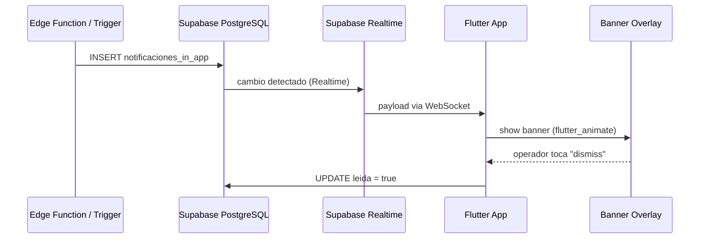
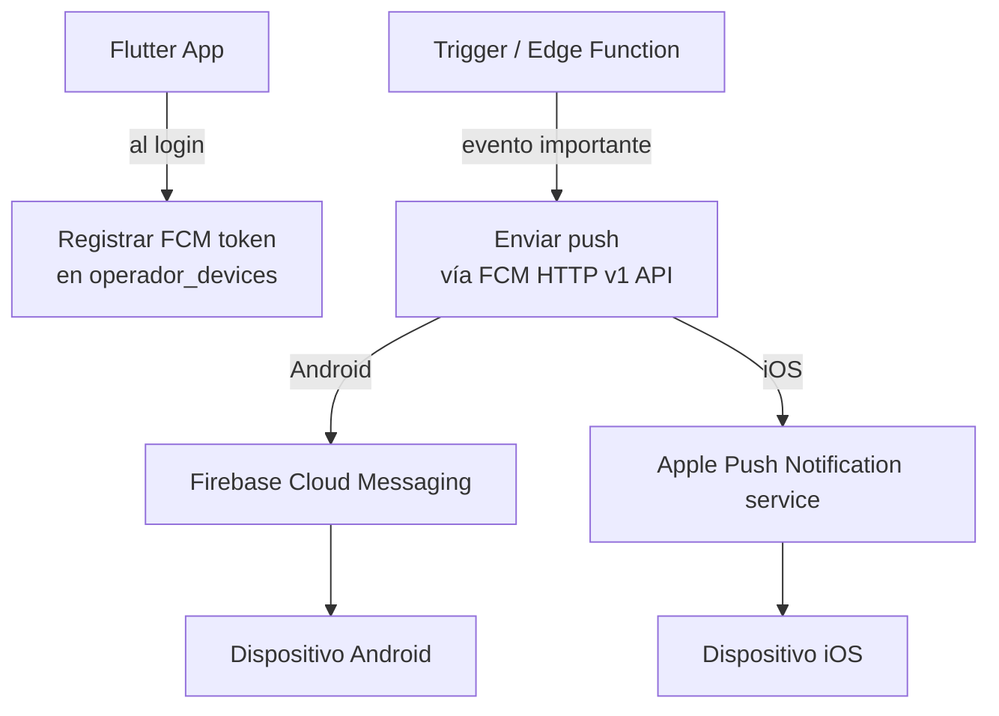

# Estrategia de Notificaciones — OperadorApp

## Resumen

Hay dos tipos de notificaciones con implementaciones distintas:

| Tipo | Estado | Implementación |
|------|--------|----------------|
| In-app (banners dentro de la app) | **Fase 1 — funcional** | Supabase Realtime + estado Riverpod |
| Push (FCM/APNs cuando app está cerrada) | **Pospuesto a Fase 8** | Stub listo, falta cuenta Apple Developer |

---

## Notificaciones In-App (Fase 1)

### Cómo funcionan

1. El backend inserta un registro en `notificaciones_in_app` (Edge Function o trigger)
2. Supabase Realtime notifica al cliente vía WebSocket
3. El `NotificationProvider` recibe el evento y actualiza el estado
4. La UI muestra un banner overlay animado con `flutter_animate`
5. El operador puede marcar como leída (UPDATE `leida = true`)



### Qué disparará notificaciones in-app

- Viaje asignado / modificado
- Puntos acreditados al cerrar un viaje
- Estado de canje actualizado por RH
- Alertas de seguridad del día
- Ascenso de nivel de operador

---

## Notificaciones Push (Fase 8 — pospuesto)

### Por qué se pospone

| Requisito | Estado |
|-----------|--------|
| Cuenta Apple Developer ($99/año) | Pendiente |
| Mac para compilar iOS | Pendiente |
| Proyecto Firebase (FCM para Android) | Fácil, pero lo centralizamos cuando tengamos iOS también |
| Certificados APNs (.p8) | Pendiente cuenta Apple |

**Para Android solo**, FCM es suficiente y no requiere Mac. Se puede activar antes si se prioriza.

### Cómo funcionarán (diseño listo)



### Tabla `operador_devices`

```sql
-- Ya en el esquema. Almacena el token FCM por dispositivo.
-- Un operador puede tener múltiples dispositivos (teléfono + tablet).
-- El token se actualiza en cada login o cuando FCM lo renueva.
```

---

## Interfaz `NotificationService`

La interfaz está definida desde Fase 1. Las implementaciones conmutan sin tocar la UI.

```dart
// lib/core/services/notification_service.dart

abstract class NotificationService {
  /// Inicializa el servicio. Retorna el FCM token si está disponible.
  Future<String?> initialize();

  /// Muestra un banner in-app con los datos de la notificación.
  Future<void> showInAppBanner(AppNotification notification);

  /// Registra el dispositivo para push (FCM token → Supabase).
  Future<void> registerDevice(String operatorId);

  /// Cancela el registro del dispositivo (logout).
  Future<void> unregisterDevice(String operatorId);

  /// Stream de notificaciones recibidas mientras la app está abierta.
  Stream<AppNotification> get incomingNotifications;
}
```

### Implementaciones

```dart
// Fase 1: solo in-app vía Realtime, sin push real
class InAppNotificationService implements NotificationService { ... }

// Fase 8: FCM real + in-app
class FcmNotificationService implements NotificationService { ... }
```

La selección se hace en el provider de DI:

```dart
// lib/core/services/providers/notification_provider.dart
@riverpod
NotificationService notificationService(Ref ref) {
  final config = ref.read(appConfigProvider);
  return config.pushEnabled
    ? FcmNotificationService(ref.read(supabaseClientProvider))
    : InAppNotificationService(ref.read(supabaseClientProvider));
}
```

---

## Modelo `AppNotification`

```dart
@freezed
class AppNotification with _$AppNotification {
  const factory AppNotification({
    required String id,
    required String title,
    required String body,
    required NotificationType type,
    required DateTime createdAt,
    required bool isRead,
    Map<String, dynamic>? metadata,
  }) = _AppNotification;
}

enum NotificationType {
  tripAssigned,
  pointsEarned,
  rewardStatusChanged,
  levelUp,
  securityAlert,
  general,
}
```

---

## Checklist para activar push real

### Android (FCM)
- [ ] Crear proyecto en Firebase Console
- [ ] Descargar `google-services.json` → `android/app/`
- [ ] Agregar plugin `google-services` en `android/build.gradle`
- [ ] Implementar `FcmNotificationService` con `firebase_messaging`
- [ ] Configurar Edge Function para enviar push via FCM HTTP v1 API

### iOS (APNs)
- [ ] Cuenta Apple Developer activa
- [ ] Crear App ID con Push Notifications habilitado
- [ ] Generar Auth Key (.p8) en Apple Developer
- [ ] Subir .p8 a Firebase Console
- [ ] Compilar en macOS con Xcode
- [ ] Agregar `Runner.entitlements` con `aps-environment`

### Supabase (backend)
- [ ] Guardar credenciales FCM/APNs como secrets en Supabase
- [ ] Crear Edge Function `send_push_notification`
- [ ] Conectar triggers a la función de envío

---

## UX de notificaciones

### Banner in-app
- Aparece desde la parte superior con animación de slide + fade
- Duración: 4 segundos, descartable con swipe
- Toque → navega a la pantalla relevante (viaje, canje, perfil)
- Color y ícono según tipo de notificación

### Badge de no leídas
- Ícono en NavigationBar muestra count de no leídas
- Se actualiza en tiempo real via Supabase Realtime
- Se limpia al entrar a la pantalla de notificaciones
