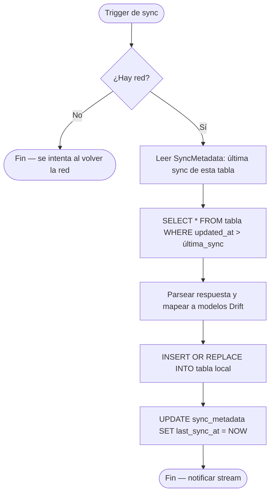
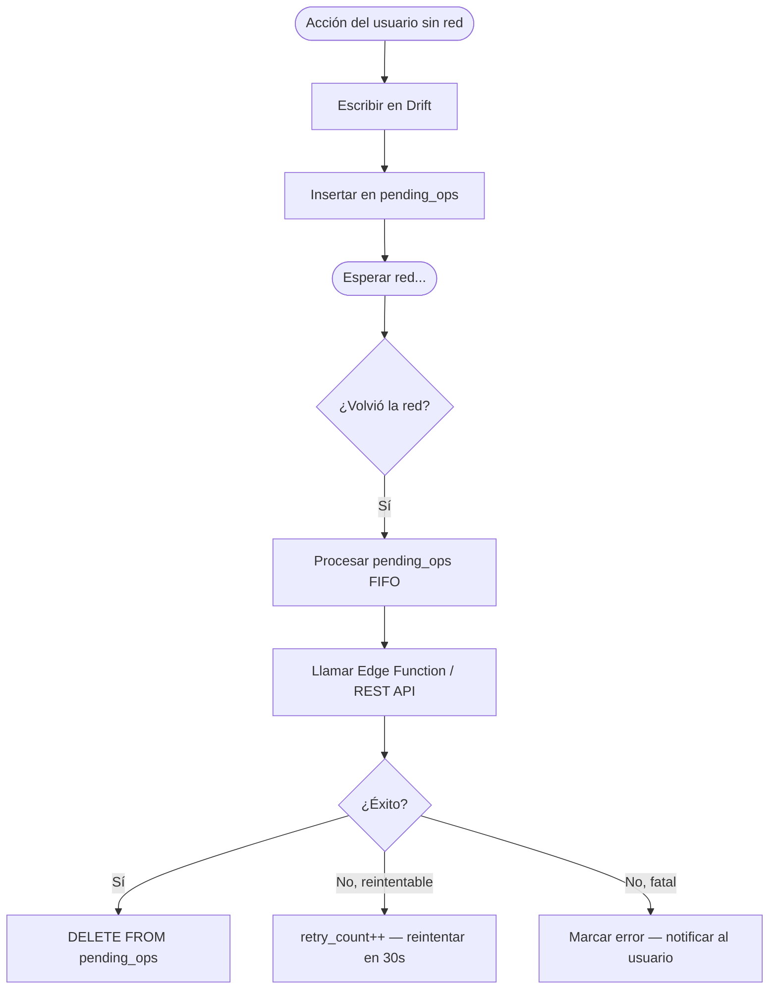

# Estrategia Offline-First — OperadorApp

## Principio fundamental

**La UI siempre lee de Drift (SQLite local)**. Supabase es el origen autoritativo de datos,
pero el operador nunca espera a la red para ver información. La sincronización ocurre en background.

---

## ¿Qué se cachea y por cuánto tiempo?

| Tabla local | Origen remoto | TTL / política |
|-------------|---------------|----------------|
| `operadores` | `operadores` | Indefinido; se refresca al iniciar sesión y cada 30 min |
| `niveles_operador` | `niveles_operador` | 24 horas (cambia raramente) |
| `viajes` | `viajes` | Indefinido; sync incremental por `updated_at` |
| `viaje_puntos_gps` | `viaje_puntos_gps` | Solo viaje activo + últimos 5 viajes; se purga al pasar 30 días |
| `reportes` | `reportes` | Viajes activo + últimos 10 viajes |
| `incidencias` | `incidencias` | Misma política que reportes |
| `alertas_seguridad` | `alertas_seguridad` | Misma política que reportes |
| `premios_catalogo` | `premios_catalogo` | 6 horas; crítico para el flujo de canje |
| `premios_canjeados` | `premios_canjeados` | Indefinido; sync cada vez que se abre la sección |
| `movimientos_puntos` | `movimientos_puntos` | Últimos 90 días; paginación infinita bajo demanda |
| `notificaciones_in_app` | `notificaciones_in_app` | Últimas 50; se purgan localmente si >100 |
| `configuracion_operador` | `configuracion_operador` | Indefinido; fuente local es autoritativa para tema/idioma |
| `tractos` | `tractos` | 24 horas |
| `historial_tractos_operador` | `historial_tractos_operador` | Indefinido; sync al abrir la sección |
| `pending_ops` | — | Local only; se elimina al confirmar sync exitoso |

---

## Esquema de Drift (espejo parcial de Supabase)

```dart
// lib/core/database/app_database.dart

@DriftDatabase(tables: [
  OperadoresTable,
  NivelesOperadorTable,
  TractosTable,
  ViajesTable,
  ViajePuntosGpsTable,
  HistorialTractosTable,
  ReportesTable,
  IncidenciasTable,
  AlertasTable,
  PremiosCatalogoTable,
  PremiosCanjeadosTable,
  MovimientosPuntosTable,
  NotificacionesTable,
  ConfiguracionTable,
  PendingOpsTable,
  SyncMetadataTable,
])
class AppDatabase extends _$AppDatabase { ... }
```

### Tabla de operaciones pendientes

```dart
class PendingOpsTable extends Table {
  IntColumn get id => integer().autoIncrement()();
  TextColumn get operationType => text()(); // 'redeem_reward', 'update_profile', etc.
  TextColumn get payload => text()();       // JSON con los datos de la operación
  IntColumn get retryCount => integer().withDefault(const Constant(0))();
  DateTimeColumn get createdAt => dateTime()();
  DateTimeColumn get lastAttemptAt => dateTime().nullable()();
  TextColumn get errorMessage => text().nullable()();
}
```

### Tabla de metadatos de sincronización

```dart
class SyncMetadataTable extends Table {
  TextColumn get tableName => text()();        // nombre de la tabla
  DateTimeColumn get lastSyncAt => dateTime().nullable()();
  TextColumn get lastSyncedId => text().nullable()(); // para sync incremental por ID
}
```

---

## Política de sincronización

### Pull (Supabase → Drift)



**Triggers de pull:**
1. Al iniciar la app (datos críticos: perfil, viaje activo)
2. Al volver a primer plano (`AppLifecycleState.resumed`)
3. Al recuperar conexión de red (evento de `connectivity_plus`)
4. Al abrir una sección específica (viajes, premios, tractos)
5. Timer periódico cada 5 minutos para datos activos

### Push (Drift → Supabase, vía operaciones pendientes)



---

## Resolución de conflictos por tabla

| Tabla | Estrategia | Razón |
|-------|------------|-------|
| `viajes` | **server-wins** | Datos críticos de negocio; el sistema externo GPS es autoritativo |
| `viaje_puntos_gps` | **server-wins** | Solo escribe el proveedor externo, la app solo lee |
| `operadores` (datos de empresa) | **server-wins** | Nombre, número, antigüedad los gestiona RH |
| `configuracion_operador` | **last-write-wins** | El operador es el único que cambia tema/idioma |
| `premios_catalogo` | **server-wins** | RH gestiona el catálogo |
| `premios_canjeados` | **server-wins** | El backend valida y es autoritativo |
| `notificaciones_in_app` | **server-wins** | Solo se crean desde el backend |
| `pending_ops` | **local-only** | Cola temporal, no existe en remoto |

**Implementación server-wins:**
```dart
// Al recibir datos del servidor, simplemente hacemos upsert
await db.into(db.viajesTable).insertOnConflictUpdate(nuevoViaje);
```

**Implementación last-write-wins:**
```dart
// Si el timestamp local es más reciente, preservamos local
final local = await db.getConfiguracion(operadorId);
if (remoto.updatedAt.isAfter(local.updatedAt)) {
  await db.into(db.configuracionTable).insertOnConflictUpdate(remoto);
}
// Si no, hacemos push de local al servidor
```

---

## Cola de operaciones pendientes

### Operaciones que se encolan

| Tipo | Payload | Endpoint |
|------|---------|----------|
| `redeem_reward` | `{operadorId, premioId}` | Edge Function `canjear_premio` |
| `update_profile_photo` | `{operadorId, localImagePath}` | Storage upload + DB update |
| `mark_notification_read` | `{notificationId}` | REST PATCH |
| `update_settings` | `{operadorId, settings}` | REST PATCH |

### Reintentos

- Máximo **5 reintentos** con backoff exponencial (30s, 60s, 120s, 240s, 480s)
- Errores `4xx` se marcan como fatales (no reintentar — son errores de validación)
- Errores `5xx` y de red se reintentan
- Al alcanzar 5 reintentos: notificar al usuario con opción de reintentar manualmente

---

## UX cuando hay / no hay red

### Sin red

- No se muestra ningún error invasivo; la app funciona normalmente con datos cacheados
- Indicador sutil: ícono de nube con "×" en el header (pequeño, no distrae)
- Si el usuario intenta una acción que requiere red (canjear premio): snackbar informativo
  _"Sin conexión. Tu solicitud se enviará cuando vuelva la red."_
- La acción se guarda en `pending_ops` y se ejecuta al recuperar conexión

### Recuperando red

- El `SyncService` detecta el evento de conectividad
- Procesa `pending_ops` de forma silenciosa
- Si hay cambios remotos nuevos, actualiza la UI automáticamente (el stream de Drift notifica)
- Banner opcional: _"Sincronización completada"_ (configurable, por default silencioso)

### Datos desactualizados

- Timestamp de última sincronización visible en Settings
- Si los datos tienen más de 24 horas sin sync: badge amarillo en el indicador
- Si tienen más de 48 horas: badge rojo + mensaje en Settings

---

## Sincronización de viaje activo

El viaje activo es el dato más crítico y tiene su propia lógica:

```dart
// SyncService.watchActiveTrip()
// Se suscribe a Supabase Realtime para el viaje activo del operador.
// Los puntos GPS los inserta el sistema externo de proveedores.
// Esta suscripción recibe cada nuevo punto GPS en tiempo real.

final subscription = supabase
  .from('viaje_puntos_gps')
  .stream(primaryKey: ['id'])
  .eq('viaje_id', activeTrip.id)
  .order('timestamp_gps')
  .listen((data) {
    // Upsert en Drift → el mapa se actualiza automáticamente via stream
  });
```

---

## Testing de la estrategia offline

```dart
// Simular sin red
test('muestra datos cacheados cuando no hay red', () async {
  // 1. Poblar Drift con datos de viajes
  await db.into(db.viajesTable).insert(testViaje);
  
  // 2. Simular sin conectividad
  when(() => mockConnectivity.isOnline).thenReturn(false);
  
  // 3. Verificar que el repositorio retorna datos locales
  final result = await tripsRepository.getTrips();
  expect(result.isRight(), true);
  expect(result.getRight().toNullable()!.length, 1);
});

test('encola operación de canje cuando no hay red', () async {
  when(() => mockConnectivity.isOnline).thenReturn(false);
  await rewardsRepository.redeemReward('premio-id');
  
  final pending = await db.select(db.pendingOpsTable).get();
  expect(pending.first.operationType, 'redeem_reward');
});
```
