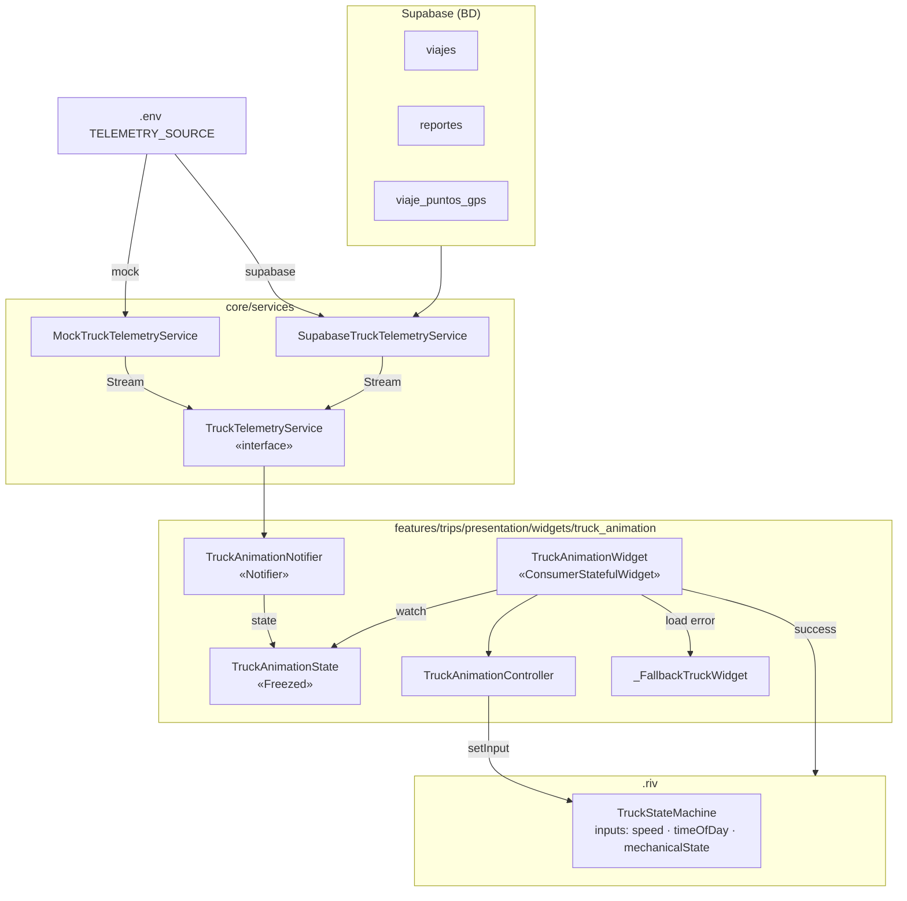
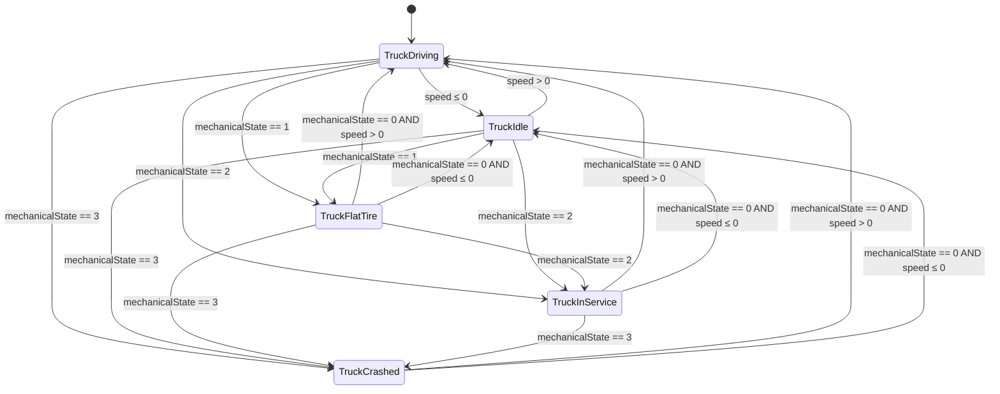
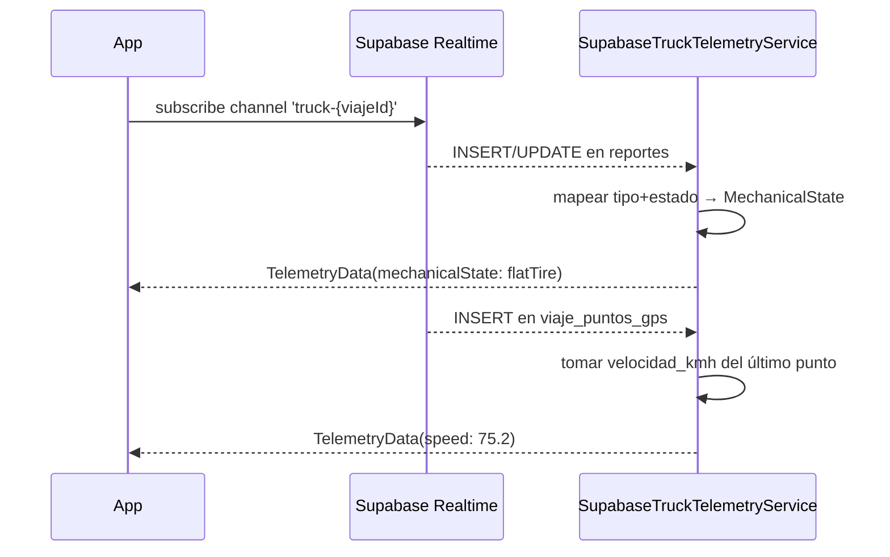

# Animación Reactiva del Tracto — Diseño Técnico

Feature: `truck_animation`
Estado: Fase 0 — diseño aprobado, pendiente implementación
Última actualización: 2026-05-14

---

## Resumen

Reemplaza el mapa miniatura en el `ActiveTripCard` (Caso A del Home dinámico) por una
animación Rive de un tractocamión en vista lateral que reacciona al estado real del viaje.
La animación es infinita mientras el viaje está activo y cambia visualmente según hora del día,
estado mecánico y velocidad. Diseñada para recibir datos reales de telemetría en el futuro.

---

## Arquitectura general



---

## Estructura de archivos

```
lib/
  core/
    config/
      app_config.dart                     ← agregar TELEMETRY_SOURCE
    services/
      truck_telemetry_service.dart        ← interface + MockImpl + SupabaseImpl
  features/
    trips/
      presentation/
        widgets/
          truck_animation/
            truck_animation_state.dart    ← modelo Freezed
            truck_animation_controller.dart ← wrapper Rive
            truck_animation_notifier.dart ← Notifier<TruckAnimationState>
            truck_animation_provider.dart ← providers Riverpod
            truck_animation_widget.dart   ← widget principal
          active_trip_card.dart           ← reemplaza TripMapView por TruckAnimationWidget

assets/
  animations/
    truck_drive.riv                       ← entregable del animador
    truck_placeholder.png                 ← fallback estático (temporal)

docs/
  features/
    truck-animation.md                    ← este archivo
    truck-animation-rive-brief.md         ← brief para el animador
```

---

## Modelo de datos: TelemetryData

```dart
// core/services/truck_telemetry_service.dart

class TelemetryData {
  final double speed;           // km/h, 0.0–120.0
  final double timeOfDay;       // hora decimal 0.0–24.0
  final MechanicalState mechanicalState;
}

enum MechanicalState {
  ok,          // 0 — tracto en buen estado
  flatTire,    // 1 — llanta ponchada
  inService,   // 2 — en mantenimiento
  crashed,     // 3 — accidentado
}
```

### Mapeo BD → MechanicalState

| Condición en `reportes`                        | MechanicalState  |
|------------------------------------------------|------------------|
| Sin reportes abiertos para el viaje activo     | `ok`             |
| `tipo = 'llanta'` AND `estado = 'abierto'`     | `flatTire`       |
| `tipo = 'mantenimiento'` AND `estado = 'abierto'` | `inService`   |
| `tipo = 'choque'` AND `estado = 'abierto'`     | `crashed`        |
| Múltiples reportes → prioridad: choque > inService > flatTire | — |

### Mapeo GPS → speed

- **MVP (mock)**: simulado por `MockTruckTelemetryService`
- **Fase 2**: último registro de `viaje_puntos_gps.velocidad_kmh`; si es null, calcular
  `Δdistancia / Δtiempo` entre los dos últimos puntos GPS

### timeOfDay

- **MVP y Fase 2**: hora local del dispositivo (`DateTime.now().hour + minute/60.0`)
- **Futuro**: hora del último punto GPS (zona horaria de la ruta)

---

## TruckAnimationState

```dart
// truck_animation_state.dart

@freezed
sealed class TruckAnimationState with _$TruckAnimationState {
  const factory TruckAnimationState({
    @Default(0.0)  double speed,
    @Default(12.0) double timeOfDay,
    @Default(MechanicalState.ok) MechanicalState mechanicalState,
    // Fase 2:
    // @Default(WeatherState.clear) WeatherState weather,
    // @Default(DriverState.alert)  DriverState driverState,
  }) = _TruckAnimationState;
}
```

---

## State Machine de Rive: TruckStateMachine

### Inputs (nombres exactos — case-sensitive)

| Nombre            | Tipo   | Rango     | Descripción                                  |
|-------------------|--------|-----------|----------------------------------------------|
| `speed`           | Number | 0.0–120.0 | Velocidad en km/h. Controla parallax y ruedas|
| `timeOfDay`       | Number | 0.0–24.0  | Hora decimal. Controla iluminación ambiente  |
| `mechanicalState` | Number | 0–3 (int) | 0=ok, 1=flatTire, 2=inService, 3=crashed     |

### States

| State            | Descripción                                              | Fondo       |
|------------------|----------------------------------------------------------|-------------|
| `TruckDriving`   | Conducción normal. Parallax activo, ruedas girando.      | Desplazando |
| `TruckIdle`      | Detenido, motor encendido. Bounce sutil, fondo quieto.   | Estático    |
| `TruckFlatTire`  | Conducción irregular. Cabina cojea, parallax lento.      | Desplazando |
| `TruckInService` | Detenido. Mecánico visible, caja de herramientas.        | Estático    |
| `TruckCrashed`   | Accidentado. Humo del cofre, tracto torcido.             | Estático    |

### Transiciones



> `timeOfDay` NO genera transiciones de estado — afecta visualmente dentro de cada estado
> mediante blend de colores y visibilidad de capas (faros, estrellas, tono del cielo).

---

## TruckAnimationController

Wrapper ligero que encapsula el acceso a la `StateMachine` de Rive.
Expone métodos tipados; el widget lo usa sin saber nada de la API de Rive internamente.

```dart
// truck_animation_controller.dart

class TruckAnimationController {
  RiveWidgetController? _riveCtrl;
  bool _initialized = false;

  /// Llamar desde el callback onRiveInit del widget.
  void initialize(RiveWidgetController ctrl) {
    _riveCtrl = ctrl;
    _initialized = true;
  }

  void setSpeed(double speed) =>
      _riveCtrl?.stateMachine?.number('speed')?.value = speed.clamp(0, 120);

  void setTimeOfDay(double hour) =>
      _riveCtrl?.stateMachine?.number('timeOfDay')?.value = hour.clamp(0, 24);

  void setMechanicalState(MechanicalState state) =>
      _riveCtrl?.stateMachine?.number('mechanicalState')?.value =
          state.index.toDouble();

  void applyState(TruckAnimationState s) {
    if (!_initialized) return;
    setSpeed(s.speed);
    setTimeOfDay(s.timeOfDay);
    setMechanicalState(s.mechanicalState);
  }

  void dispose() => _riveCtrl = null;
}
```

> API Rive 0.14+: `RiveWidgetController` con `StateMachineSelector.byName('TruckStateMachine')`.
> Si la versión instalada usa la API legacy (`StateMachineController.fromArtboard`),
> reemplazar los accesos a `stateMachine.number()` por `controller.findInput<double>()`.

---

## TruckAnimationNotifier

```dart
// truck_animation_notifier.dart

class TruckAnimationNotifier extends Notifier<TruckAnimationState> {
  StreamSubscription<TelemetryData>? _sub;

  @override
  TruckAnimationState build() {
    final service = ref.watch(truckTelemetryServiceProvider);
    _sub?.cancel();
    _sub = service.telemetryStream.listen(_onTelemetry);
    ref.onDispose(() => _sub?.cancel());
    return const TruckAnimationState();
  }

  void _onTelemetry(TelemetryData data) {
    state = state.copyWith(
      speed: data.speed,
      timeOfDay: data.timeOfDay,
      mechanicalState: data.mechanicalState,
    );
  }
}
```

---

## TruckAnimationWidget

`ConsumerStatefulWidget` para manejar el ciclo de vida del controller de Rive
y escuchar cambios de estado sin reconstruir el árbol completo.

```dart
// truck_animation_widget.dart

class TruckAnimationWidget extends ConsumerStatefulWidget { ... }

class _State extends ConsumerState<TruckAnimationWidget>
    with WidgetsBindingObserver {

  final _ctrl = TruckAnimationController();
  late final RiveWidgetController _riveCtrl;
  bool _loadError = false;

  @override
  void initState() {
    super.initState();
    WidgetsBinding.instance.addObserver(this); // para pausa en background
    _riveCtrl = RiveWidgetController(
      StateMachineSelector.byName('TruckStateMachine'),
    );
  }

  @override
  void didChangeDependencies() {
    super.didChangeDependencies();
    // Escuchar cambios del estado sin reconstruir widget
    ref.listenManual(truckAnimationProvider, (prev, next) {
      _ctrl.applyState(next);
    });
  }

  @override
  void didChangeAppLifecycleState(AppLifecycleState state) {
    // Pausar animación cuando app va a background (ahorro de batería)
    if (state == AppLifecycleState.paused) {
      _riveCtrl.isActive = false;
    } else if (state == AppLifecycleState.resumed) {
      _riveCtrl.isActive = true;
    }
  }

  @override
  void dispose() {
    WidgetsBinding.instance.removeObserver(this);
    _riveCtrl.dispose();
    _ctrl.dispose();
    super.dispose();
  }

  @override
  Widget build(BuildContext context) {
    if (_loadError) return const _FallbackTruckWidget();

    return RiveAnimation.asset(
      'assets/animations/truck_drive.riv',
      artboard: 'TruckScene',
      controllers: [_riveCtrl],
      fit: BoxFit.cover,
      onInit: (_) => _ctrl.initialize(_riveCtrl),
      // Error: si falla la carga del .riv
      // RiveAnimation no expone onError directamente;
      // usar FutureBuilder + RiveFile.asset() para interceptar errores.
    );
  }
}
```

### Fallback si el .riv no carga

```dart
class _FallbackTruckWidget extends StatelessWidget {
  // Imagen estática del tracto o Container con color de marca.
  // Se muestra si RiveFile.asset() lanza excepción.
  ...
}
```

Patrón robusto de carga con fallback:

```dart
// En initState():
RiveFile.asset('assets/animations/truck_drive.riv').then(
  (file) => setState(() => _riveFile = file),
  onError: (_) => setState(() => _loadError = true),
);
```

---

## TruckTelemetryService

```dart
// core/services/truck_telemetry_service.dart

abstract interface class TruckTelemetryService {
  Stream<TelemetryData> get telemetryStream;
  Future<void> dispose();
}
```

### MockTruckTelemetryService

Genera datos simulados en ciclo para desarrollo sin BD:

| Ciclo           | Comportamiento                                              |
|-----------------|-------------------------------------------------------------|
| 0–30 s          | Día, speed 60–90 km/h con ruido gaussiano suave             |
| 30–50 s         | Atardecer gradual (timeOfDay 18→20)                         |
| 50–80 s         | Noche, speed 50–70 km/h, faros encendidos                   |
| 80–90 s         | Simula llanta ponchada (`flatTire`), speed baja a 20        |
| 90–100 s        | Llanta reparada (`ok`), retoma velocidad                    |
| 100–120 s       | Velocidad 0 (idle), `inService` por 10 s, retoma viaje      |
| Reinicia ciclo  |                                                             |

### SupabaseTruckTelemetryService (Fase 2)

```dart
class SupabaseTruckTelemetryService implements TruckTelemetryService {
  // 1. Subscribe a reportes del viaje activo via Realtime
  //    → detectar cambios en tipo/estado → mapear a MechanicalState
  // 2. Subscribe a viaje_puntos_gps via Realtime
  //    → tomar velocidad_kmh del último punto
  // 3. timeOfDay: hora local del device (inmediato)
  //
  // Canal Realtime:
  //   supabase.channel('truck-telemetry')
  //     .onPostgresChanges(event: PostgresChangeEvent.all, schema: 'public',
  //                        table: 'reportes', filter: 'viaje_id=eq.$viajeId')
  //     .onPostgresChanges(event: PostgresChangeEvent.insert, schema: 'public',
  //                        table: 'viaje_puntos_gps', filter: 'viaje_id=eq.$viajeId')
  //     .subscribe()
}
```

---

## Selección de implementación (AppConfig + .env)

```
# .env
TELEMETRY_SOURCE=mock       # durante desarrollo
TELEMETRY_SOURCE=supabase   # producción y QA
```

```dart
// core/config/app_config.dart — agregar:
static String get telemetrySource =>
    dotenv.env['TELEMETRY_SOURCE'] ?? 'mock';
```

```dart
// truck_animation_provider.dart
final truckTelemetryServiceProvider = Provider<TruckTelemetryService>((ref) {
  return switch (AppConfig.telemetrySource) {
    'supabase' => SupabaseTruckTelemetryService(
        ref.read(supabaseClientProvider),
        viajeId: ref.read(activeTripIdProvider) ?? '',
      ),
    _ => MockTruckTelemetryService(),
  };
});
```

---

## Providers Riverpod

```dart
// truck_animation_provider.dart

// Provider del servicio de telemetría (mock o supabase según .env)
final truckTelemetryServiceProvider = Provider<TruckTelemetryService>(...);

// Notifier principal
final truckAnimationProvider =
    NotifierProvider<TruckAnimationNotifier, TruckAnimationState>(
      TruckAnimationNotifier.new,
    );
```

---

## Integración en ActiveTripCard

Reemplazar el bloque de `TripMapView` (altura 160) por `TruckAnimationWidget`:

```dart
// active_trip_card.dart — antes:
TripMapView(points: detail.gpsPoints, height: 160)

// después:
SizedBox(
  height: 160,
  child: ClipRect(child: TruckAnimationWidget()),
)
```

El `TruckAnimationWidget` no necesita el `trip` como parámetro — lee el estado
de `truckAnimationProvider` que ya observa el viaje activo.

---

## Capas del artboard (para el animador)

```
TruckScene (artboard 900×400 px)
│
├── Layer: Sky              z=0 — cielo, color animado por timeOfDay
├── Layer: FarBg            z=1 — cerros lejanos, speed*0.05
├── Layer: MidBg            z=2 — arbustos / siluetas medias, speed*0.2
├── Layer: Poles            z=3 — postes de luz, speed*0.7
├── Layer: Road             z=4 — carretera + líneas discontinuas, speed*1.0
├── Layer: ShadowGround     z=5 — sombra plana bajo llantas
├── Layer: Truck            z=6 — tracto completo (cab + trailer + llantas)
│   ├── Group: Cab          — cabina azul petróleo
│   ├── Group: Trailer      — caja/trailer naranja
│   ├── Group: WheelFront   — llanta delantera (gira por speed)
│   ├── Group: WheelRear1   — llanta trasera 1
│   └── Group: WheelRear2   — llanta trasera 2
└── Layer: FX               z=7 — humo, lluvia, cono de faros, ZZZ
```

---

## Consideraciones de performance

| Problema                       | Solución                                                  |
|--------------------------------|-----------------------------------------------------------|
| Animación en background        | `WidgetsBindingObserver` → `isActive = false` en paused  |
| CPU alto por timer 0ms         | Evitar animaciones con duration=0; usar min 16ms         |
| Rebuild innecesarios           | `listenManual` en lugar de `watch` para updates de Rive  |
| Memoria del .riv               | Precachear con `RiveFile.asset()` en `initState`         |
| Parallax costoso               | Limitar a 4 capas; mover solo X, sin rotaciones complejas|
| Tamaño del archivo             | Mantener ≤200 KB; sin bitmaps embebidos                  |

---

## Tests

| Capa                      | Tipo          | Qué probar                                          |
|---------------------------|---------------|-----------------------------------------------------|
| `TruckAnimationNotifier`  | Unit test     | Estado inicial, aplicación de TelemetryData         |
| `MockTruckTelemetryService` | Unit test   | Que el stream emite en el ciclo esperado            |
| `TruckAnimationController`| Unit test     | `applyState` llama métodos Rive correctos (mock ctrl)|
| `TruckAnimationWidget`    | Widget test   | Renderiza sin errores, muestra fallback si .riv nulo|
| Integración               | Widget test   | `ActiveTripCard` con viaje activo muestra el widget |

---

## Dependencias a agregar en pubspec.yaml

```yaml
dependencies:
  rive: ^0.14.6          # verificar última versión en pub.dev
```

```yaml
flutter:
  assets:
    - assets/animations/truck_drive.riv
    - assets/animations/truck_placeholder.png  # fallback temporal
```

---

## Fase 2: Supabase Realtime (diseño de suscripción)



Tabla `viaje_puntos_gps` ya está en `supabase_realtime` publication (ver DATABASE.md).
Agregar `reportes` a la publication cuando se implemente Fase 2:
```sql
ALTER PUBLICATION supabase_realtime ADD TABLE reportes;
```
